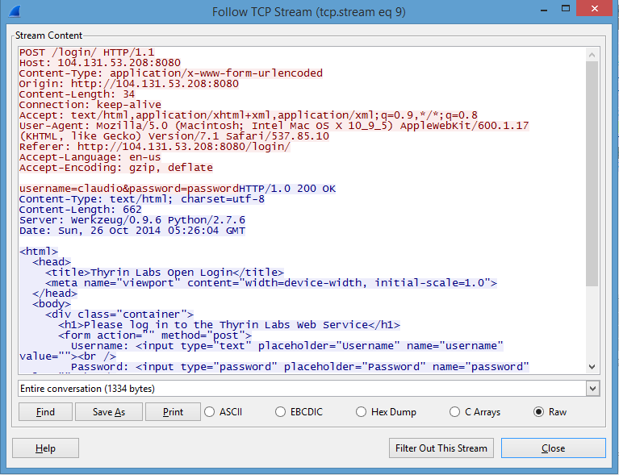
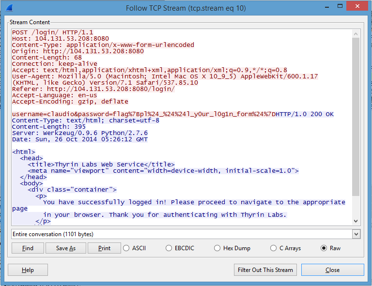

## Intercepted Post - 40 (Forensics) ##
#### Writeup By Shwinn ###

Created: 2014-11-09 19:42:47

Last modified: 2014-11-09 23:28:11

### Problem ###

We intercepted some of your Dad's web activity. Can you get a password from [his traffic?](https://picoctf.com/problem-static/forensics/intercepted-post/intercept.pcap). You can also view the traffic on [CloudShark](https://www.cloudshark.org/captures/5d19d8de342c).

### Hint ###

Login is usually done through a POST request. Then, depending on what characters are in Claudio's password, they may be specially encoded...

## Answer ##

### Overview ###

Find a POST request (by using CTRL + F), Follow the TCP Stream, and Find the UTF-8 Encoded Password. Then use an online UTF-8 to ASCII converter to get the flag.

### Details ###

For the purposes of this writeup we will be using the [Wireshark](https://www.wireshark.org/) Application in order to analyze the .pcap file given. The problem tells us that the flag is a password from your Dad's web activity, and the hint tells us to look for a POST Request to find the password.

Since we know we are looking for a POST Request, we should search for "POST" by using CTRL + F. Each time we search we receive a packet with the word POST somewhere in it. For each possible packet with a POST Request and the possible password, we can right-click on it and select "Follow TCP Stream". This should bring up a new window with the contents of that TCP Stream.

The first time we search for POST requests we see a packet for posting on Wikipedia.org. By following the TCP Stream and glancing at the contents we can quickly see that this is not the packet of data we are looking for.

We search again and receive a packet for logging into Thyrin Labs Web Service. By looking at the TCP Stream we see the following:

Looking at the stream we can see that a claudio has been filled in for the username, but that the password hasn't been filled in yet.

We go back and search for a POST Request one last time and follow the TCP Stream for the packet. We see the following:

Bingo! We see flag%7Bpl%24_%24%24l_y0ur_l0g1n_form%24%7D filled out as the password.

Almost there just one last step. The Hint tells us that the password is encoded, and since we found this in Web Traffic, the password is encoded using UTF-8 as almost all web related things are. We can convert the password into ASCII by using an [Online Unicode to ASCIII Converter](http://www.rapidmonkey.com/unicodeconverter/). Now we just enter the password we received there and see that our decoded password is flag{pl$_$$l_y0ur_l0g1n_form$}.

### Flag ###

    pl$_$$l_y0ur_l0g1n_form$
