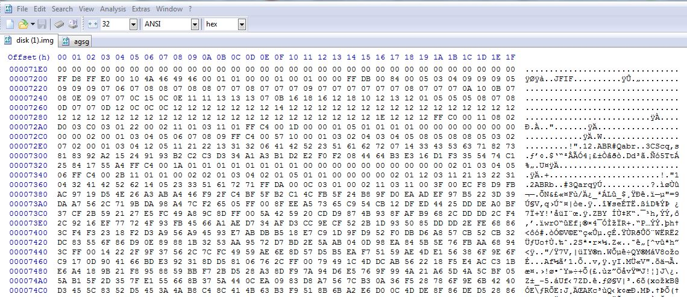
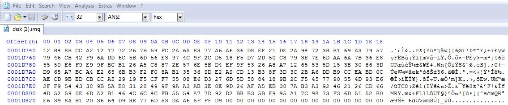
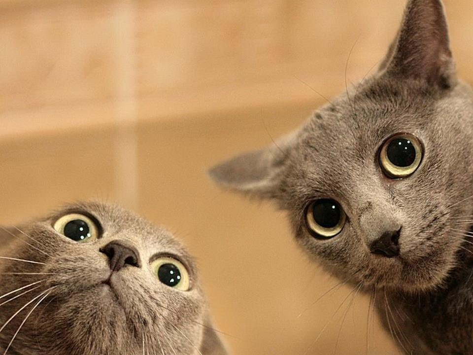
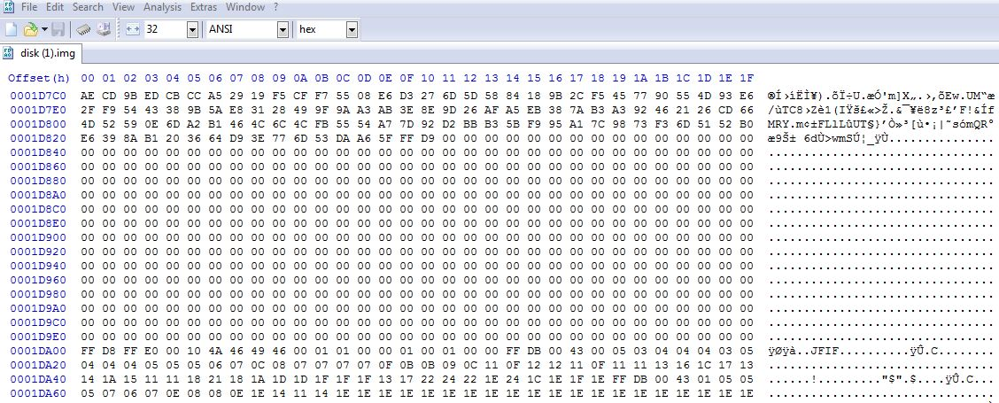

## Snapcat - 80 (Forensics) ##
####Writeup by Oksisane
Created: 2014-11-08 12:24:40
Last modified: 2014-11-09 22:28:37

### Problem ###

It was found that a Daedalus employee was storing his personal files on a work computer. Unfortunately, he corrupted the filesystem before we could prove it. Can you take a look? Download [here](https://picoctf.com/problem-static/forensics/snapcat/disk.img).

### Hint ###

It seems like data recovery can be performed on the disk.img--maybe you'll find something?

## Answer ##

### Overview ###

Use a hex editor to extract several jpg files from `disk.img`

### Details ###
The first thing we try to read `disk.img` is open it with a archive manager such as [7zip](http://www.7-zip.org/). However, this fails, so we will have to rely on manually inspecting the file. Opening the file with a hex editor (we used [HxD](http://mh-nexus.de/en/hxd/)) and scrolling through we can see a bunch of large blocks of data followed by 00 (which is null or no data in hex). We can identify this data using [file signatures](http://en.wikipedia.org/wiki/File_signature). A file signature is standard set of hex values that serve as start and end values for almost any common file format, allowing a program to easily identify how it should interpret a file. For our block of data we see it starts with ``FF D8``

and has the trailing characters ``FF D9``

Using [this page](http://www.garykessler.net/library/file_sigs.html), we can quickly see that  our block of data is a JPG image. To extract it, we simply copy all the data from the ``FF D8`` to the ``FF D9`` into a separate file in HxD, save it, and open it with a image viewer (the image is quite large, so don't worry if you have to scroll for a while when copying). When we open it with a image viewer we see:

Sweet! We can extract files from the disk.img, but we don't quite have our flag yet. Looking back at `disk.img` we can see another image file is placed just below the one we copied out. Let's extract it too!

When we open this in an image editor, we get our flag:

Here are few other cat pictures included in the `disk.img` by the Daedalus employee

### Flag ###

    i_can_has_cheezburger

