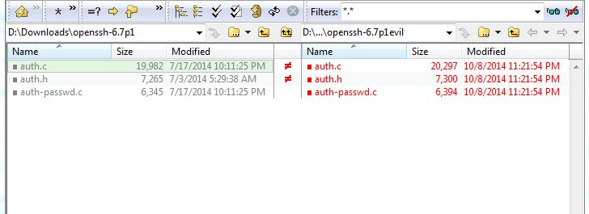

## SSH Backdoor - 100 (Forensics) ##
####writeup by Oksisane

### Problem ###

Some hackers have broken into my server `backdoor.picoctf.com` and locked my user out (my username is jon). I need to retrieve the `flag.txt` file from my home directory.
The last thing we noticed in out network logs show is the attacker downloading [this](https://picoctf.com/problem-static/forensics/SSHBackdoor/openssh-6.7p1-evil.tar.gz). Can you figure out a way to get back into my account?

### Hint ###

The attackers left a backdoor in the openssh server. Maybe you could compare it to the real code?

## Answer ##

### Overview ###

Compare the real openssh-6.7p1 with the one supplied, identify/decrypt a one char xor cipher, and use the resulting plaintext to login to a server with ssh.

### Details ###

The file left for us is a archive containing a directory which claims it is `openssh-6.7p1`. The hint us to real `oppenssh-6.7p1` which we were able to find hosted [here](http://ftp.openbsd.org/pub/OpenBSD/OpenSSH/portable/openssh-6.7p1.tar.gz). To compare the two, we used [Beyond Compare](http://www.scootersoftware.com/), which allows us to easily see the differences in files between the two versions of the code.
Here is an example of the comparison:




Right away we can see that the `auth.c` `auth.h` and `auth-passwd.c` files are the only ones that have been changed, and a little further investigation reveals the functions added by the hackers (reproduced below).
```c
static int frobcmp(const char *chk, const char *str) {
	int rc = 0;
	size_t len = strlen(str);
	char *s = xstrdup(str);
	memfrob(s, len);

	if (strcmp(chk, s) == 0) {
		rc = 1;
	}

	free(s);
	return rc;
}

int check_password(const char *password) {
	return frobcmp("CGCDSE_XGKIBCDOY^OKFCDMSE_XLFKMY", password);
}

````
The frobcmp() function serves as an additional authentication mode meaning that if it returns 1, we are allowed into the server!
Looking at the code we can see the string `CGCDSE_XGKIBCDOY^OKFCDMSE_XLFKMY` is being passed in to be compared to our password after `memfrob` is run on it. A little googling [reveals](http://linux.die.net/man/3/memfrob) that memfrob is a rudimentary encryption technique that encrypts the input data by preforming an XOR with it an the number `42`. XOR is the term for a  Binary Exclusive OR. XOR has the unique property of being the inverse of itself, that is to say if you XOR something twice with the same key, you get your original text back. Since we have the text (`CGCDSE_XGKIBCDOY^OKFCDMSE_XLFKMY`) which the XORed version of our password is being compared with, we can simply XOR it with 42 to get what our password should be *before* it is XORed. Here is an example of xoring every character with 42 in python:
```python
''.join(chr(i) for i in [ord(a) ^ 42 for a in "CGCDSE_XGKIBCDOY^OKFCDMSE_XLFKMY"])
```
Which gives us the password `iminyourmachinestealingyourflags`. However, this is not quite the solution. Going back to the problem text, we realize we have to login to `backdoor.picoctf.com` with the username `jon` and the password, we just figured out, `iminyourmachinestealingyourflags`. In the shell server, this command will do that for us:
```bash
ssh jon@backdoor.picoctf.com
```
Once we are in, we simply `cat flag.txt` which prints the flag to our console!
### Flag ###

ssshhhhh_theres_a_backdoor
