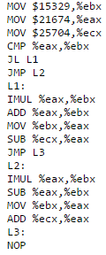

## Basic ASM - 60 (Reverse Engineering) ##
#### Writeup by Shwinn ####

Created: 2014-11-13 22:22:35

Last modified: [2014-11-17 20:58:07](https://github.com/Oksisane/PicoCTF-2014-Writeups/commits/master/reverse_engineering/basic_asm.md)

### Problem ###
We found this program [snippet.txt](https://picoctf.com/api/autogen/serve/snippet.txt?static=false&pid=654a1385b6d2f9091efe2af864d8d2da), but we're having some trouble figuring it out. What's the value of %eax when the last instruction (the NOP) runs?

### Hint ###
You may want to convert the assembly into some equivalent C code, which will be easier to read!

## Answer ##
### Overview ###
Understand and carry out the assembly operations by hand (possibly with some help from Google).

### Details ###
The problem asks us to find the value of %eax at the end of the program. Here is the code we are supposed to look through:

One of the most important things to note is that the following Assembly code was written in AT&T/GAS Syntax, which means that the source of the operation comes before the destination.

Ex. ADD %eax, %ebx

This would add the values of %eax and %ebx, and store the new value in %ebx.

Let's walk through the program step-by-step. The first actions that occur is that 15329 is moved into %ebx (%ebx = 15329), 21674 is moved into %eax, and 25704 is moved into %ecx. The next operation is a CMP operation, where in AT&T syntax, the operation checks if the second element is less than the first element. If this is true it follows the first jump statement, and if it is false, it jumps to the second jump statement. In this case %ebx is less than %eax (15329 < 21674), so the program follows the path into the L1 function. The next thing that occurs is that %eax and %ebx are multiplied, and the value is stored into %ebx. At the end of this %ebx = 332240746. %eax is then added to %ebx and stored in %ebx, making %ebx = 332262420. The value of %ebx is then moved into %eax, making %eax = 332262420. Next %ecx is subtracted from %eax and stored into %eax, which makes %eax = 332236716. A jump to the L3 function is then called, which calls NOP and ends the program. The flag is the value of %eax at the end of the program which is 332236716.

## Flag ##
    332236716
