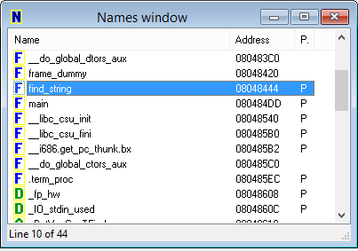

## Function Address - 60 (Reverse Engineering) ##
#### Writeup by Shwinn ####

Created: 2014-11-13 21:52:55

Last modified: [2014-11-17 20:58:07](https://github.com/Oksisane/PicoCTF-2014-Writeups/commits/master/reverse_engineering/function_address.md)

### Problem ###
We found this [program file](https://picoctf.com/problem-static/reversing/function-address/problem) on some systems. But we need the address of the 'find_string' function to do anything useful! Can you find it for us?

### Hint ###
objdump or another disassembler may be useful to you. There are only two functions in the binary that are actually created by the user, and one of them is main.

## Answer ##
### Overview ###
Open the program in a disassember such as [Hex Rays IDA](https://www.hex-rays.com/products/ida/) (There is also a free version available), open the names tab, look for the find_string function, and view the memory address of the function.

### Details ###
The question asks us to find the memory address of a the find_string function in a program. The first thing we should do is open the program in IDA as we should for any binary related problem. IDA is a very, very helpful disassembler that can do a variety of things including finding the memory address of a specific function. If you are interested in what other magical things IDA can do then a quick google result would be beneificial to you. After opening the program in IDA we can simply open the names tab and find the find_string function in the scroll down list. After finding the function in the list you can simply look the to the right and see that IDA has displayed the memory address for us, which happens to be the flag for our problem.

We see that the flag / memory address is 08048444.

### Flag ###
    08048444

